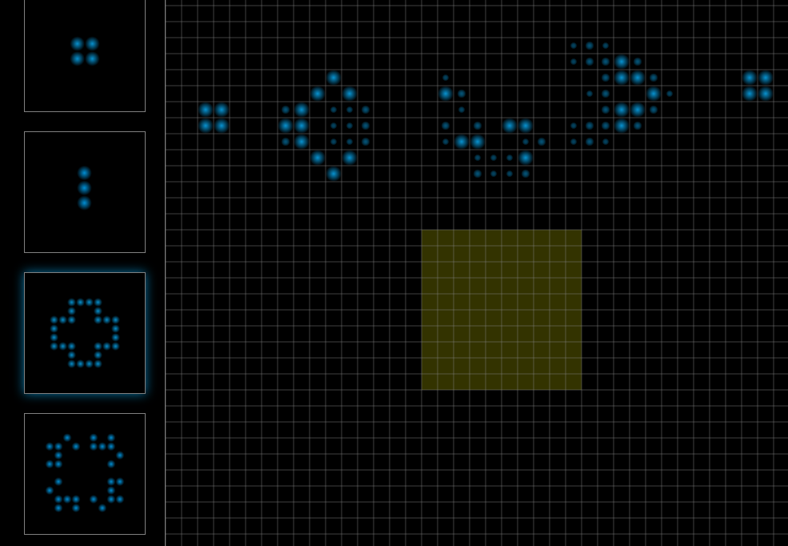

# Constellations

[Constellations][live]

[live]: http://bencalabrese.github.io/Constellations

Constellations is a Conway's Game of Life simulator built in vanilla Javascript. Using Constellations, you can manipulate the cell map and navigate it using pan and zoom to fully experience Conway's Game of Life at several different levels.

## Features & Implementation

### It's alive!

Constellations allows users to bring cells to life while the game is paused or in mid-cycle. Several presets are built in so that it's easy to see the lifespans of complex structures like BackRake One or Kok's Galaxy. After a structure has been selected, Constellations highlights the cells that will be affected on the grid so that users know exactly what they're aiming at. After all, what use is generating a spaceship if you can't make it collide with another spaceship?


<p style="text-align:center">
  
</p>

### Navigate the cell map

Controls to zoom and pan show off the best parts of Conway's Game of Life. Constellations animates cells as they die and awaken so that users can see the way that the map changes over time.

Zooming in allows users to see how cells affect each other close up. This freedom means that exploring how smaller structures evolve over time is easy. By the same token, large structures and spaceships are best viewed while zoomed out. Enabling users to pan means that they can follow that spaceship through its entire trajectory as well. The Game of Life exists on an infinite Cartesian plane and Constellations makes good use of it.

```javascript
// viewport.js

Viewport.prototype.recontextualize = function () {
  this.ctx.setTransform(
    this.zoomLevel,
    0,
    0,
    this.zoomLevel,
    this.ctx.canvas.width / 2 + this.cellFractionOffsets[0] * 5 * this.zoomLevel,
    this.ctx.canvas.height / 2 + this.cellFractionOffsets[1] * 5 * this.zoomLevel
  );
};
```
### See cells die and come alive

Constellations animates cells coming alive and dying by calculating how far along the current cycle has progressed. Using the current time and recursively calling the `Game.render` function on `requestAnimationFrame` allows the game to determine when new cells need to be calculated. In the meantime, the viewport tracks transitioning cells and renders their alpha and radius as a function of the cycle completion percentage.

The result is a clear visual representation of how the Game of Life works. It's even better if you make a laser-like zzwommp sound as the cells fade in and out.

```javascript
Game.prototype.render = function (cycleStart) {
  var currentTime = new Date().getTime() - cycleStart;
  var percentage = currentTime / this.speed;

  if (percentage >= 1) {
    percentage %= 1;
    cycleStart += this.speed;

    if (!this.tabFocus) { this.playing = false; }
    this.playing ? this.grid.toggleCells() : this.grid.finishCycle();

    this.viewport.setCellStates(this.grid.states);
  }

  this.viewport.render(percentage);

  requestAnimationFrame(this.render.bind(this, cycleStart));
};
```
